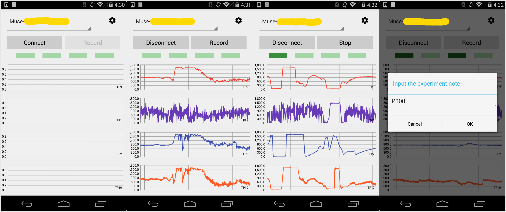

# MuseLogger 

MuseLogger is a simple application reading, logging and visualizing EEG data from [*Muse head-hand*](http://www.choosemuse.com/) on Android phones for the purpose of data analyzing.

MuseLogger is based on the official SDK provided by Muse. For more information, please refer to [*Muse Developer*](http://developer.choosemuse.com/).

## Features
* search and connect to the Muse device.
* log EEG data(currently includes raw eeg data, absolute alpha power and absolute beta power) in CSV format.
* indicate the status of each channel.
* visualize EEG data on phones' screen in real time.

## Screenshots

  

## Known Issues
* MuseLogger currently can only record raw EEG, absolute alpha band power and absolute beta band power. More configurations will be supported in the future.
* EEG visualization might result in *crazy* GC.